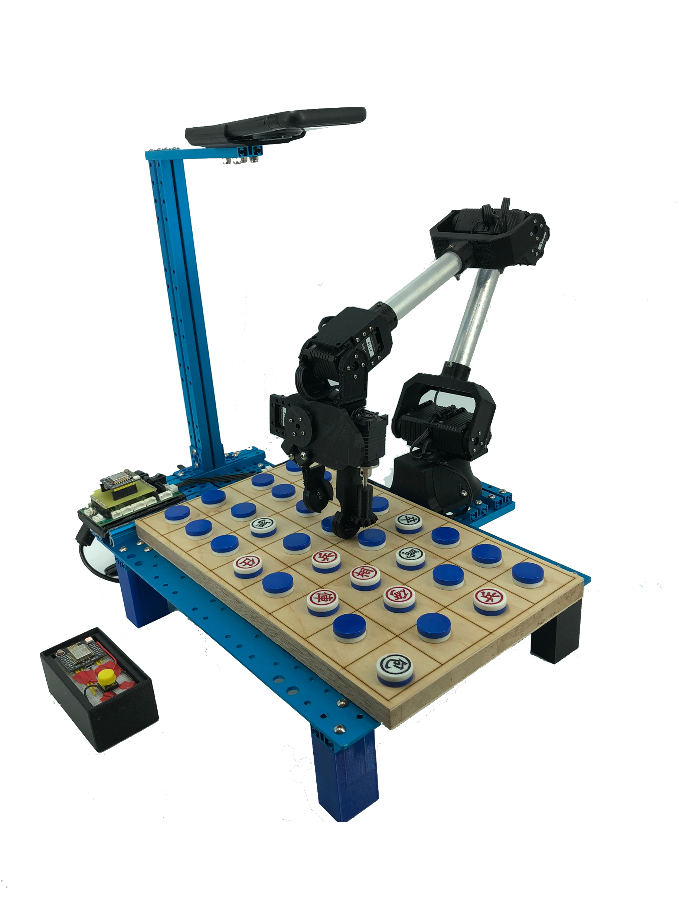

> ***Note: This is a remake of a 2020 project, rebuilt from scratch after the original code was lost — metrics may be a little bit different from the [research report](https://www.mxeduc.org.tw/scienceaward/history/projectDoc/19th/doc/SA19-120_final.pdf).***

# Darkchess Robot

<div align="center">

<br>
[](https://www.mxeduc.org.tw/scienceaward/history/projectDoc/19th/doc/SA19-120_final.pdf)
[](https://www.youtube.com/watch?v=iaBYF3ZuBAg)<br>
[](https://huggingface.co/collections/ryanlinjui/darkchess-robot-670ccb8a15991c5bdad9f10c)<br>
</div>

# 🤖 Demo

<div align="center">
  
  
</div>

# 💡 Getting Started
### Setup
Use [pixi](https://github.com/prefix-dev/pixi) to set up the development environment:

```
pixi shell
```

### Run Darkchess Robot System with Specific Mode
```bash
# Run Robot Server along with Website Monitor
python app.py --robot

# Run API Server of 'brain' & 'eye' Only
python app.py --api     
```
> Go [`config.py`](./config.py) to configure app settings before running server.

<div align="center">
  
  
</div>

# 🚀 Features
## Brain - AI Engine for Darkchess Board Game
- **Search-based Agents**
  - **Random**: *Just Random*.
  - **Min-Max**: 60% win rate versus human.
  - **Alpha-Beta**: Faster version of Min-Max.
- **Learning-based Agents**
  - **Q-Learning (QL)**: Tabular Q-learning with a discrete Q-table.
    - Metrics and Models: [Normal mode (8×4)](https://huggingface.co/ryanlinjui/darkchess-robot-brain-QL), [Small mode (3×4)](https://huggingface.co/ryanlinjui/darkchess-robot-brain-QL-small3x4).
  - **Q-Learning with MCTS (QL-MCTS)**: QL combined with PUCT MCTS for lookahead search.
    - Metrics and Models: [Normal mode (8×4)](https://huggingface.co/ryanlinjui/darkchess-robot-brain-QL-MCTS), [Small mode (3×4)](https://huggingface.co/ryanlinjui/darkchess-robot-brain-QL-MCTS-small3x4).
  - **Deep Reinforcement Learning (DRL)**: Q-learning with a neural network (DQN) replacing the Q-table.
    - Metrics and Models: [Normal mode (8×4)](https://huggingface.co/ryanlinjui/darkchess-robot-brain-DRL), [Small mode (3×4)](https://huggingface.co/ryanlinjui/darkchess-robot-brain-DRL-small3x4).
  - **Deep Reinforcement Learning with MCTS (DRL-MCTS)**: DRL combined with PUCT MCTS for lookahead search.
    - Metrics and Models: [Normal mode (8×4)](https://huggingface.co/ryanlinjui/darkchess-robot-brain-DRL-MCTS), [Small mode (3×4)](https://huggingface.co/ryanlinjui/darkchess-robot-brain-DRL-MCTS-small3x4).

> **Overall: `DRL-MCTS` ≈ `DRL` ≥ `Alpha-Beta` = `Min-Max` > `QL-MCTS` > `QL` > `Random`**.  
> For small mode (3x4), read [here](https://github.com/ryanlinjui/darkchess-robot/blob/main/brain/utils.py#L102) for detail.  
> For Brain training/testing script, refer to [`brain_train.ipynb`](./brain_train.ipynb).

## Eye – Real-World Detection and Recognition of Darkchess Board States
- **Model Architecture:** VGGNet-based darkchess board recognition
- **Training Accuracy:** 99.9%
- **Training Loss:** 7.2336e-06
- **Real-world Test Success Rate:** 98.9%

> For Eye training/testing script, refer to [`eye_train.ipynb`](./eye_train.ipynb).  
> Detailed model information is available on [Huggingface](https://huggingface.co/ryanlinjui/darkchess-robot-eye-VGGNet).

## Arm – Robotic Arm Control for Real-World Darkchess Applications
Our **Third-Generation Catcher** model with robotic arm that doing **Chess-Flipping** actions in Real-World Darkchess game.

> Explore the [Hardware](./arm/hardware) and [Firmware](./arm/firmware) for more details.

## AIoT – Darkchess Robot System Operable via WiFi
- API server collects training data from both Eye and Brain features. 
- Just a single button press starts gameplay via WiFi remote control.

> For API specifications, please see [documentation](https://github.com/ryanlinjui/darkchess-robot/wiki).

# 🌟 Awards 
- **Gold Medal (Int'l Top 50/408)** - 7th Kaohsiung International Invention & Design EXPO (2020)
- **Merit (Nat'l Top 20/661)** - [19th Macronix Science Awards (2020)](https://www.mxeduc.org.tw/scienceaward/history/projectDoc/19th/production.htm)
- **Second Place (Nat'l 2/200up)** - [12th i-ONE NARLabs Instrument Technology Innovation Competition (2020)](https://i-one.org.tw/Home/ListContents/107?ATimes=12)
- **Second Place in Engineering(I) (Nat'l 2/151)** - [60th National Primary and High School Science Fair (2020)](https://twsf.ntsec.gov.tw/activity/race-1/60/pdf/NPHSF2020-052310.pdf?746)
- **First Place in Engineering(I) (Reg)** - [53rd Taipei Primary and High School Science Fair (2020)](https://sites.google.com/csjh.tp.edu.tw/science/高級中等學校組/工程學科一?authuser=0#h.6xilplkz0fpy)
- **First Place in Engineering(I) (H.S.)** - Taipei Municipal Neihu Vocational High School Independent Study (2020)

# ®️ Patent
- **Invention Patent** - *DARK CHESS ROBOT (Dec 1, 2021) - TWI748780B*
- **Utility Model Patent** - *Robot arm gripper (Feb 21, 2021) - TWM608235U*

<div align="center">
  <a href="./assets/patent/TWI748780B.pdf">
    
  </a>
  <a href="assets/patent/TWM608235U.pdf">
    
  </a>
</div>
<br>

> Please visit [here](https://tiponet.tipo.gov.tw/gpss/) and search for the patent code as mentioned above.
